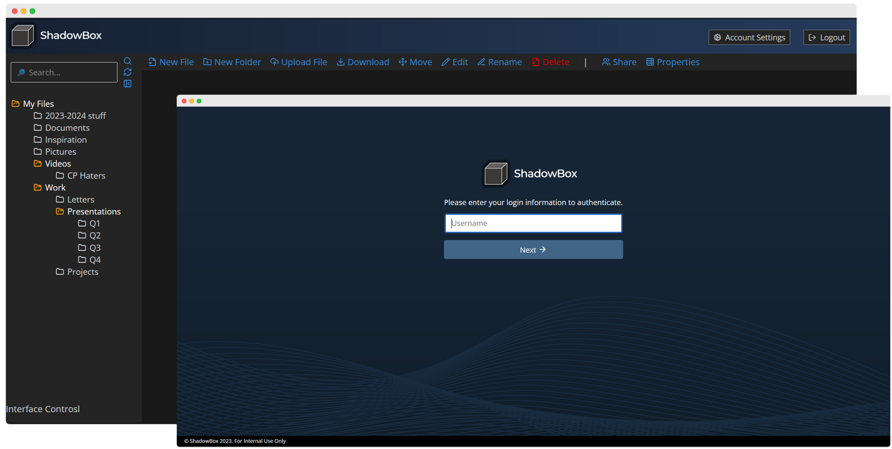

# ShadowBox-Dev   

ShadowBox *will* be a zero-knowledge open-source web-based file storage & hosting system, featuring partial or full encryption through cryptographic ciphers. Contributors are welcome to help develop this project.
> [!WARNING]  
> This is a developmental repository of ShadowBox. As this software is still being developed, some or all features may not be available as it is currently a work in progress.

## Setup Development Environment
1. Copy ``.env.example`` to ``.env`` and fill in the required fields.
    - ``MYSQL_DATABASE_HOST`` is the hostname of the MariaDB or MySQL server.
    - ``MYSQL_DATABASE_USER`` is the username of the MariaDB or MySQL server.
    - ``MYSQL_DATABASE_PASSWORD`` is the password of the MariaDB or MySQL server.
    - ``MYSQL_INSTDATA_DATABASE`` is the name of the database that contains the instance data of our SB server. Import the ``schemas/shadowbox-data.sql`` file into this database and generate a new Bcrypt hash for the ``admin`` account.
    - ``MYSQL_FILETABLES_DATABASE`` is the name of the database that contains the file tables of our SB server. Import the ``schemas/shadowbox-filetables.sql`` file into this database.
    - ``SESSION_SECRET`` is the secret key used to sign the session cookies. This can be any secure random string.
    - ``FILE_BIN_BASEPATH`` is the path to the directory where uploaded files will be stored. This directory must be writable by the SB server and is recommended to be stored on a seperate partition. **This is the default file storage method**.

2. Setup a MariaDB instance with the schemas that are provided in the instance. Refer to Step 1 for adding the schemas to the environmental variables file.
3. Run ``npm install`` to install all dependencies
4. Run ``npm run a`` then ``npm run b`` concurrently to start the Nodemon development server and Scss compiler respectively. Or, use ``node src/server.js``.
5. It is recommended to generate your own SSL certificates using the ``generateCertificates`` scripts. Both a shell and PowerShell script is provided. This will export several certificates which can be added to your browser's certificate store to allow for HTTPS connections to the server. **Non-HTTPS connections are not officially supported.**

## Creating File Bucket
Storing uploaded files are supported on partitions mounted to the computer running the server or a network share. Specify the name of the directory to store these files in the ``.env`` file.
1. Create a directory or folder which the SB instance as permissions to write & ready to.
2. Specify that directory in the ``FILE_BIN_BASEPATH`` environmental variable.
3. Restart the Server
> [!NOTE]
> The SB server will not create the directory for you. You must create the directory yourself. **NEVER** manually attempt to edit any contents of the filebin, as this may cause the server to crash, corrupt the filebin, or misalign the filetable stored on the SQL server.

## What works right now and what doesnt?
- [x] User Authentication
- [x] Rendering Login & File Area
- [x] Introspecting files
- [x] File Upload (debug only)
- [ ] File Upload (production)
- [ ] File Download
- [ ] File Deletion
- [ ] Searching
